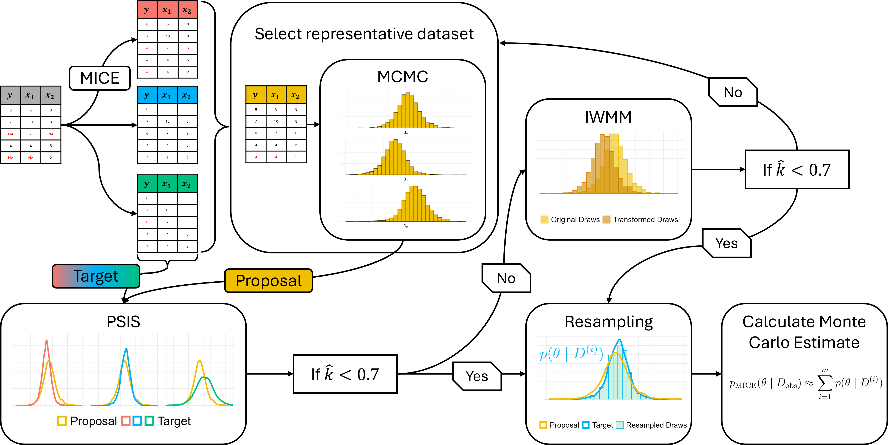

# Efficient Uncertainty Propagation in Bayesian Two-Step Procedures

__Authors:__  Svenja Jedhoff, Hadi Kutabi, Anne Meyer, Paul-Christian Bürkner

------------------------------------------------------------------------

## Overview

This repository contains code to replicate key experiments from our
[paper]() 'Efficient Uncertainty Propagation in Bayesian Two-Step Procedures' as well
as running the iterative algorithm for the multiple imputation setup for new datasets.



------------------------------------------------------------------------


## Reproducing the Simulation Studies

Step-by-step instructions for replicating the simulation study on **surrogate models** are provided in:  

```
simulation_surrogate/run_simulation.R
```

The code for the **multiple imputation** simulation study can be found in:  

```
simulation_multiple_imputation/run_simulation.R
```

Each of these main scripts calls supporting functions that are organized modularly:

- Utility functions are located in `utils.R` within the respective folders.  
- The main simulation function, which implements the iterative algorithm, 
is defined in `simulation_fct.R` within the respective folders.


------------------------------------------------------------------------

## Reproducing NYC Taxi Case Study

The real world dataset case study with the NYC Taxi dataset can be reproduced as well.
Therefore, look in the folder `case_study_multiple_imputation`. In the data folder
the object `nyc_2016_03_07.rds` contains the dataset for the corresponding day, already
included with the variables build with the OSM. With the file `prepare_data.R` can the 
data be formatted and each hourly dataset will be imputed. In file `run_case_study.R` for each
hour the brute-force MCMC approach can be run additionally to the iterative algorithm.
The results are saved in the `results` subfolder and can be merged for further processing.


------------------------------------------------------------------------

## Running the algorithm on your dataset

The developed iterative algorithm in the multiple imputation setting can be applied to
any regression task with missing data. Code for running the regression model with the
algorithm on your dataset can be found in
```
iterative_algo_imputation.R
```
The algorithm needs a dataset as input and a formula for specifying the regression model.
Additional specifications for the model, which will be calculated in 
[brms](https://paulbuerkner.com/brms/) can be passed through the ... operator. 
The algorithm return two lists, where the first one 'draws' contains a brms 
draws matrix corresponding to each of the imputed datasets, which are saved in the second list.


------------------------------------------------------------------------

## Citation

```bibtex
@misc{jedhoff2025uncertainty,
      title={Efficient Uncertainty Propagation in Bayesian Two-Step Procedures}, 
      author={Svenja Jedhoff and Hadi Kutabi and Anne Meyer and Paul-Christian Bürkner},
      year={2025},
      eprint={2505.10510},
      archivePrefix={arXiv},
      primaryClass={stat.ME},
      url={https://arxiv.org/abs/2505.10510}, 
}
```
